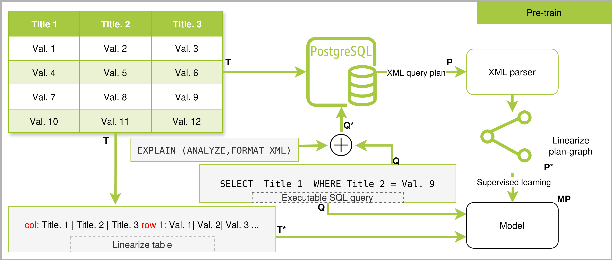

# Pre-trained Language Model for Table Question Answering via Query Plan Generation

## Overview

Tabular data is ubiquitous across scientific, business, and industrial domains, yet automatic interpretation of tables remains a significant challenge due to their structural heterogeneity and lack of explicit semantics. **Table Question Answering (TQA)** aims to enable machines to answer natural language questions over tabular data, but current methods often suffer from low accuracy and poor numerical reasoning.

**TableQA-BART** introduces a novel approach: instead of directly generating or executing SQL queries, our method pre-trains a BART-based language model to generate *computational graphs* (query plans) analogous to SQL execution plans in relational databases. This paradigm shift reduces computational complexity and minimizes errors from implicit computations, leading to more robust and semantically consistent TQA systems.

---

## Key Features

- **Query Plan Generation:**  

  The model learns to generate linearized computational graphs (query plans) from SQL queries and tables, rather than executing SQL directly.

- **Pre-training on Large-Scale Data:**  

  Pre-trained on 3.8 million SQL–table pairs, then fine-tuned on the WikiSQL dataset (80,000+ examples).

- **Superior Performance:**  

  Achieves **95.1% denotation accuracy** on WikiSQL test set, outperforming the TAPEX baseline.

- **Generalizability:**  

  The pre-trained model can be fine-tuned for various TQA datasets (e.g., WTQ, SQuALL, FeTaQA, TabFact).

---

## Pre-training Task

The pre-training pipeline consists of the following steps:

1. **Input Preparation:**  

   Concatenate an executable SQL query ($$Q$$) with a linearized table ($$T'$$) and feed it to the model.

2. **Query Plan Extraction:**  

   Execute the SQL query ($$Q$$) with the `EXPLAIN` prefix on the source table ($$T$$) to obtain the execution plan ($$P$$).

3. **Plan Linearization:**  

   Transform the execution plan ($$P$$) into a linearized plan-graph ($$P'$$).

4. **Supervised Training:**  

   Train the model to generate a plan ($$MP$$) that matches the linearized plan-graph ($$P'$$).

---

## Model Architecture

- **Base Model:** [BART-large](https://arxiv.org/abs/1910.13461)

- **Input:** Concatenated SQL query and linearized table

- **Output:** Linearized query plan (plan-graph)

- **Tokenizer:** Custom tokenizer adapted for SQL and tabular data

---

## Results 

| Model                                         | DA dev | DA test |
|-----------------------------------------------|--------|---------|
| TAPEX sql-executor (upper SQL)                | 54.8   | 61.1    |
| TAPEX sql-executor                            | 40.4   | 41.0    |
| Query Plan Generator (upper SQL)              | 37.1   | 63.4    |
| Query Plan Generator                          | 37.4   | 68.1    |
| Fine-tuned Query Plan Generator (upper SQL)   | 94.1   | 94.2    |
| **Fine-tuned Query Plan Generator**           | **95.0** | **95.1** |

---

## Applications

- **Intelligent Table-Based QA Systems**

- **Semantic Data Exploration**

- **Business Intelligence Automation**

- **Scientific Data Analysis**

---

## Acknowledgements
Zhong, Victor, Caiming Xiong, and Richard Socher. "Seq2sql: Generating structured queries from natural language using reinforcement learning." arXiv preprint arXiv:1709.00103 (2017).

Lewis, Mike, et al. "Bart: Denoising sequence-to-sequence pre-training for natural language generation, translation, and comprehension." arXiv preprint arXiv:1910.13461 (2019).

Liu, Qian, et al. "TAPEX: Table pre-training via learning a neural SQL executor." arXiv preprint arXiv:2107.07653 (2021).

